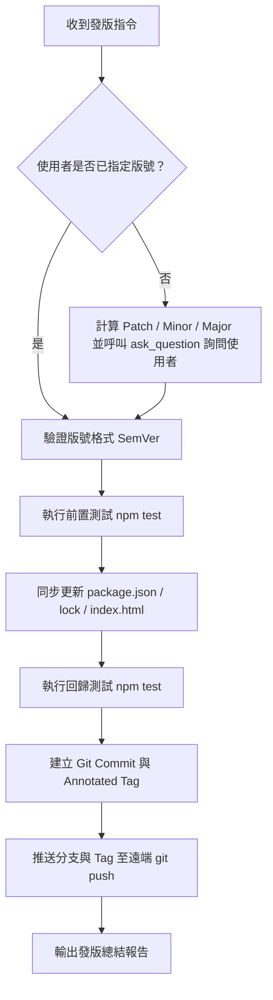

# Release Workflow (專案發版技能)

本技能定義了「波波小遊戲 (mini-games)」專案的標準發版與版號發布工作流程。

---

## 執行流程概覽



---

## 詳細執行步驟

### 1. 取得並確認目標版號 (Resolve Target Version)

1. 先執行以下指令取得當前版本與建議版本（Patch / Minor / Major）：
   ```bash
   node .agents/skills/release/scripts/bump-version.js --suggest
   ```
2. **判斷使用者是否已明確提供版號**：
   - **已提供版號**（例如使用者說「發布 v1.13.0」、「release 1.13.0」）：
     - 驗證版本格式是否符合語意化版本（SemVer）。
     - 直接採用該版號進入下一步。
   - **未提供版號**（例如使用者僅說「發版」、「release」或「幫我發個新版本」）：
     - **必須使用 `ask_question` 工具**詢問使用者要發布哪一個版本號，提供計算出來的 Patch、Minor、Major 選項。
     - 範例提問內容：
       - `Patch (v1.12.1) - 錯誤修復與小幅度優化`
       - `Minor (v1.13.0) - 新增小遊戲或新功能特色 (推薦)`
       - `Major (v2.0.0) - 重大架構改動或重大重構`

---

### 2. 執行前置檢查與測試 (Pre-release Verification)

在修改任何檔案前，先確認現有程式碼品質與 Git 狀態：

1. **執行自動化測試**：
   ```bash
   npm test
   ```
   *若測試未全部通過，應立即中斷發版流程並修正問題，不得帶錯發版。*

2. **檢查 Git 工作區狀態**：
   ```bash
   git status
   ```
   *確認是否有未整理的檔案或需要先處理的未暫存改動。*

---

### 3. 同步更新版本檔案 (Bump Version Files)

執行專屬版本同步腳本，自動更新 `package.json`、`package-lock.json` 與 `index.html` 的頁尾版本資訊：

```bash
node .agents/skills/release/scripts/bump-version.js <目標版本號>
```

> **更新標的**：
> - `package.json`: `"version": "<version>"`
> - `package-lock.json`: `"version": "<version>"` 與 `packages[""].version`
> - `index.html`: `<footer>© 2026 波波小遊戲 · v<version></footer>`

---

### 4. 再次驗證測試 (Post-bump Validation)

確保版本號更新後，所有測試與語法編譯依然 100% 通過：

```bash
npm test
```

---

### 5. 建立 Git Commit 與 Tag (Git Commit & Tagging)

依據專案規範（**Conventional Commits** 與 **繁體中文（台灣）**）：

1. **暫存變更檔案**：
   ```bash
   git add package.json package-lock.json index.html
   ```
   *(若有其他隨同發版的檔案也可一併加入暫存區)*

2. **建立 Commit**：
   ```bash
   git commit -m "chore(release): 發布版本 v<目標版本號>"
   ```

3. **建立附註標籤 (Annotated Tag)**：
   ```bash
   git tag -a v<目標版本號> -m "發布版本 v<目標版本號>"
   ```

---

### 6. 推送至遠端儲存庫 (Push to Remote)

1. **取得當前分支名稱**：
   ```bash
   git branch --show-current
   ```

2. **推送分支與 Tag 至遠端**：
   ```bash
   git push origin <當前分支名稱>
   git push origin v<目標版本號>
   ```

---

### 7. 輸出發版成果摘要 (Release Summary)

向使用者回報發版成果：
- **發布版本號**：`vX.Y.Z`
- **Git Commit 雜湊**：`git rev-parse --short HEAD`
- **Git Tag 標籤**：`vX.Y.Z`
- **更新檔案清單**：`package.json`, `package-lock.json`, `index.html`
- **遠端推送狀態**：已同步推送至 `origin/<當前分支>` 及 `origin/refs/tags/vX.Y.Z`
